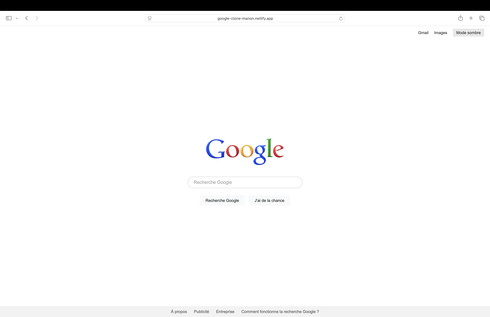

# Google clone

Une réplique simple de la page d'accueil de Google - développée dans le cadre de mon apprentisage HTML, CSS et responsive design.

---

## Démo

[Voir le site en ligne](https://google-clone-manon.netlify.app)

---

## Technologies utilisées

---

## Aperçu

---

## Structure du projet

google-clone/
- index.html
- style.css
- script.js
- images/
  - screenshot.png
- README.md

---

## Fonctionnalités

- Logo Google
- Barre de recherche
- Boutons : "Recherche Google" & "j'ai de la chance"
- Footer avec liens
- Mode sombre activable
- Design responsive

---

## Statut du projet

  
  
